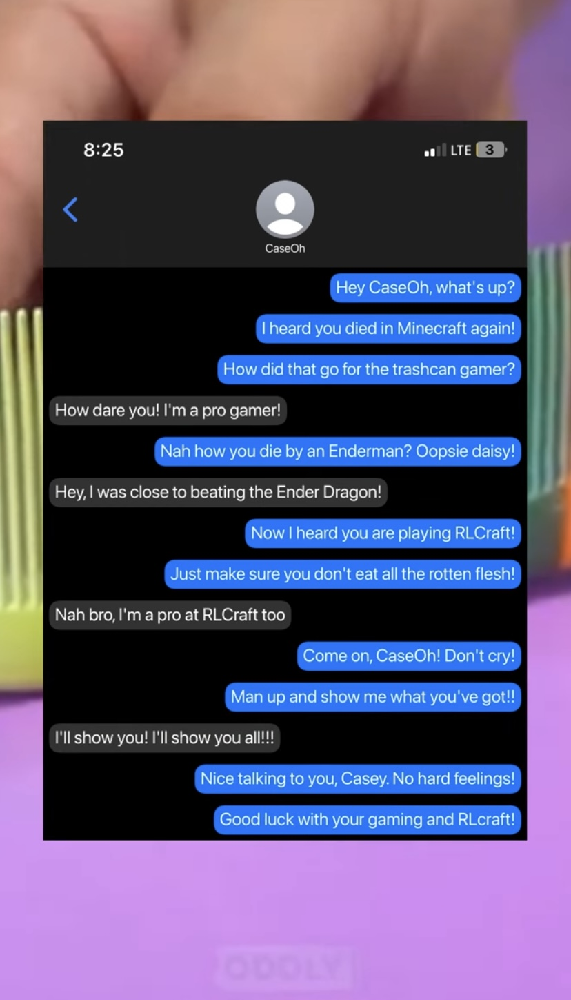
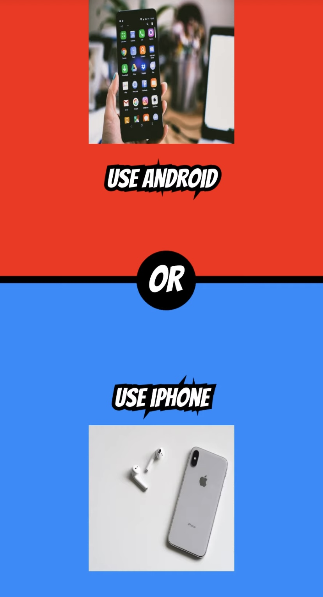

# AutoShorts - AI-powered Shorts Generator

AutoShorts is a fully fledged package that generates shorts videos with the help of AI to write the script. It can generate popular types of video seen on YouTube Shorts and TikTok.
 
If you want to support the development of this package, consider buying me a coffee:

[](https://ko-fi.com/shafilalam)

# Introduction

The package is built with a flexible abstraction layer which allows you to quickly create different types of videos with different AI tools and can be easily extended to include more types and tools internally.

This repo includes a CLI interface and JS interface. The CLI interface is built on top of the JS interface. The JS interface is the core of the package and can be used to generate videos programmatically.

**GUI interface is coming soon.**

> [!NOTE]
> This package is in the early stages of development and may have bugs - especially when interacting with AI to generate scripts. This package is not meant to be used in production environments yet. Since AI output is unpredictable, work is being done to make the output more predictable and controllable. If the AI generates an incorrect JSON output, then you can manually edit the JSON output to fix the issue. This package is subject to change and may have breaking changes in the future. Use at your own risk.

# Features
You can generate popular types of short videos seen on YouTube Shorts and TikTok like:
- Text-to-Speech (TTS) videos
- Topic-based videos with images
- Text message story videos
- 'Would you rather' videos
- Ranking item videos
- And more...

The topic-based video type can be used to generate videos on a wide range of topics like:
- News-related videos
- Educational videos
- Fun facts videos
- And more...

| Text Message Video | News Video | Quiz Video | Rank Video | Would You Rather Video |
| --- | --- | --- | --- | --- |
|  |  |  |  |  |

You can request new video types and tools to be added to the package by creating an issue on the GitHub repo.

> [!WARNING]
> The package author is not responsible for any misuse of the package. The package author is not responsible for any content generated by the package. The package author is not responsible for any legal issues arising from the use of the package. The package author is not responsible for any financial loss arising from the use of the package. Use at your own risk.

# Installation

Note: By default, the package use Ollama to generate scripts. Therefore a working Ollama installation is required. OpenAI support is coming soon.

## For JS Interface
```bash
npm install auto-shorts
```

## For CLI Interface (global installation)
```bash
npm install -g auto-shorts
```

# Example (CLI Interface)
```bash
# Install the package globally
npm install -g auto-shorts

# Download the necessary resources (to './res' folder by default)
npx auto-shorts --download

# Generate a video with AI (will find the necessary resources in the './res' folder)
npx auto-shorts -p "make a news short about TypeScript" --ttsType ElevenLabsVoice --imageType PexelsImageGen --elevenLabsAPIKey YOUR_ELEVENLABS_API_KEY --pexelsAPIKey YOUR_PEXELS_API_KEY
```

You can also run the command interactively:
```bash
npx auto-shorts
```

For help:
```bash
npx auto-shorts --help
```

# Example (JS Interface)

Note: You will need to download the necessary resources before running the code. You can do this by running the following command:
```bash
npx auto-shorts --download [path]
```

## AI-Generated Video
```javascript
const task = await genVideoWithAI(
    "make a news short about TypeScript",
    AIGenType.OllamaAIGen, {
    tempPath: 'video_temp',
    resPath: 'res',
    voiceGenType: VoiceGenType.ElevenLabsVoice,
    imageGenType: ImageGenType.PexelsImageGen,
    elevenLabsAPIKey: process.env.ELEVENLABS_API_KEY,
    pexelsAPIKey: process.env.PEXELS_API_KEY,
});

task.on('log', (log) => {
    console.info(log);
});

task.on('done', (output) => {
    console.info("--> Video generation complete! Video saved at: " + output);
});
```

## Manual Video
```javascript

/** @type {import("auto-shorts").VideoDataType} */
const data = {
    type: "topic",
    title: "TypeScript",
    description: "TypeScript is a programming language...",
    start_script: "Hello! Today we will be talking about TypeScript.",
    end_script: "That's all for today. Thanks for watching!",
    images: ["typescript logo"]
};

const task = await genVideoWithJson(
    data, {
    tempPath: 'video_temp',
    resPath: 'res',
    voiceGenType: VoiceGenType.ElevenLabsVoice,
    imageGenType: ImageGenType.GoogleScraperImageGen,
    elevenLabsAPIKey: process.env.ELEVENLABS_API_KEY,
    pexelsAPIKey: process.env.PEXELS_API_KEY,
});

task.on('log', (log) => {
    console.log(log);
});

task.on('done', (output) => {
    console.info("--> Video generation complete! Video saved at: " + output);
});
```

# API Keys

This package uses AI tools like OpenAI and ElevenLabs to generate scripts and images. You need to provide the API keys for these tools to use this package.

You need to provide the following API key depending on what tools you want to use:
- ElevenLabs API Key
- Pexels API Key
- OpenAI API Key *(coming soon)*

Make sure to provide the API keys in the environment variables with a package like `dotenv`.

# Todo
- [ ] Add GUI
- [ ] Fix logging
- [ ] Make AI output structured
- [ ] Add more video types (Twitter/X posts, Reddit posts, etc.)
- [ ] Add more AI tools (e.g., OpenAI, Neets.ai, AI Image Generators, etc.)
- [ ] Add more customization options (custom fonts, colors, images, etc.)
- [ ] Add more error handling
- [ ] Add more tests
- [ ] Add more documentation
- [ ] Add support for more general video generation (e.g., long-form videos)

**By Shafil Alam.**
